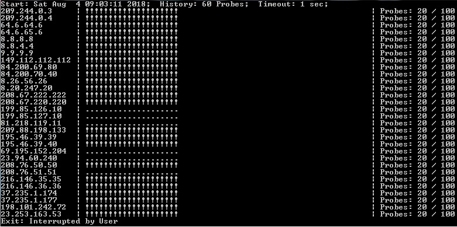

# CCMD
Tool to run command against multiple destinations (IP or Domain Name) and display results in nice format and save them automatically. 

## Example Usage
Issue ping command for multiple hosts in devices.txt file in parralel and display results:

C:\>python3 ccmd.py
  
Warning: for Windows script runs clear screen (cls) to print new results to terminal.  
By default detailed and summary logs saved into ./LOG/{ctime}/ directory.  

To run one traceroute probe in parallel against multiple destinations in devices.txt:  
C:\>python3 ccmd.py -c 1 -T

### Run Options
C:\>python ccmd.py -h  
usage: ccmd.py [-h] [-c PROBECOUNT] [-b BARLEN] [-i PROBEINTERVAL]  
               [-w PROBETIMEOUT] [-t NUMBEROFTHREADS] [-p LOGSUBDIRPREFIX]  
               [-C USERCOMMAND] [-s SRCFILE] [-ts TARGETS] [-T] [-P] [-D]  
               [-DS DNSSRV] [-S] [-v]  
  
Concurrent Command to Multiple Destinations - run commands against targets in  
semi-parallel fashion.  
  
optional arguments:  
  -h, --help          show this help message and exit  
  -c PROBECOUNT       Number of probes to run, default - 100  
  -b BARLEN           Length of probe history bar, default - 60  
  -i PROBEINTERVAL    Interval between probes in ms, default - 1000ms  
  -w PROBETIMEOUT     Probe timout interval in ms, default - 1000ms  
  -t NUMBEROFTHREADS  Number of simulteneous probe threads, default - 80  
  -p LOGSUBDIRPREFIX  String prefix for logs directory name  
  -C USERCOMMAND      Command to run, default - ping.  
  -s SRCFILE          Path to targets file, default - ./targets.txt  
  -ts TARGETS         Targets comma separated string  
  -T                  Run traceroute command  
  -P                  Run ping command  
  -D                  Perform DNS resolution  
  -DS DNSSRV          Same as -D but uses given server IP, need dnspython  
  -S                  Silent mode - no print to terminal  
  -v                  Show version  
  
## Python Version.
Only Python 3.x. Script uses standart python libraries such as os, copy, subprocess, threading etc.

## Supported OS.
So far tested on Windows 7,10 and Linux Ubuntu/CentOS only.
