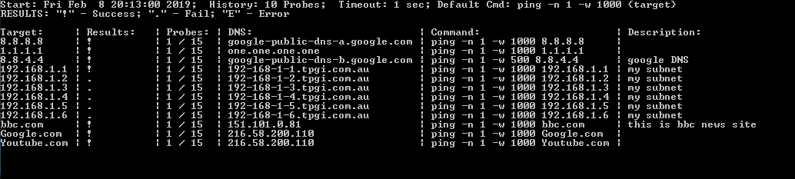

# CCMD - Concurrent Commands to Multiple Destinations
Tool to run command against multiple destinations (IP or Domain Name) and display results in nice format and save them automatically. 

## Example Usage
Issue ping command for multiple hosts in targets.txt file in parralel displaying results:

C:\>ccmd -c 15 -b 10 -D
  
Warning: for Windows script runs clear screen (cls) to print new results to terminal.  
By default detailed and summary logs saved into ./LOG/{ctime}/ directory.  
  
targets.txt content:  
8.8.8.8  
1.1.1.1  
8.8.4.4, google DNS, ping -n 1 -w 500 {target}  
192.168.1.0/29, my subnet  
bbc.com, thisis bbc news site  
Google.com  
Youtube.com  
  

To run one traceroute probe in parallel against multiple destinations in targets.txt:  
C:\>python3 ccmd.py -c 1 -T

### Run Options
C:\>python ccmd.py -h   
Concurrent Command to Multiple Destinations - run commands against targets in  
semi-parallel fashion.  
  
optional arguments:  
  -h, --help          show this help message and exit  
  -c PROBECOUNT       Number of probes to run, default - 100  
  -b BARLEN           Length of probe history bar, default - 60  
  -i PROBEINTERVAL    Interval between probes in ms, default - 1000ms  
  -w PROBETIMEOUT     Probe timout interval in ms, default - 1000ms  
  -t NUMBEROFTHREADS  Number of simulteneous probe threads, default - 80  
  -p LOGSUBDIRPREFIX  String prefix for logs directory name  
  -C USERCOMMAND      Command to run, default - ping.  
  -s SRCFILE          Path to targets file, default - ./targets.txt  
  -ts TARGETS         Targets comma separated string  
  -T                  Run traceroute command  
  -P                  Run ping command  
  -D                  Perform DNS resolution  
  -DS DNSSRV          Same as -D but uses given server IP, need dnspython  
  -S                  Silent mode - no print to terminal  
  -v                  Show version  
  
## Python Version.
Only Python 3.x. Script uses standart python libraries such as os, copy, subprocess, threading etc.

## Supported OS.
Tested with Windows 7,10 and Ubuntu/CentOS.
